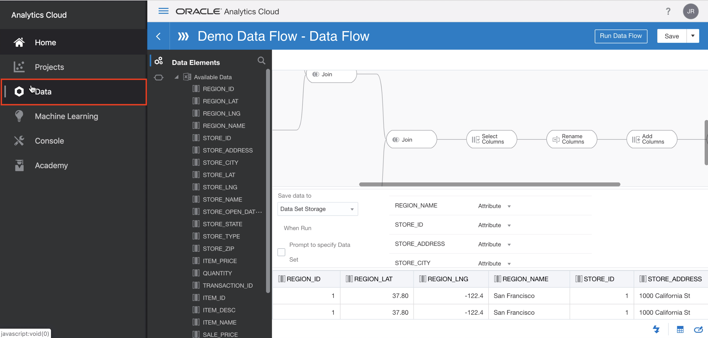
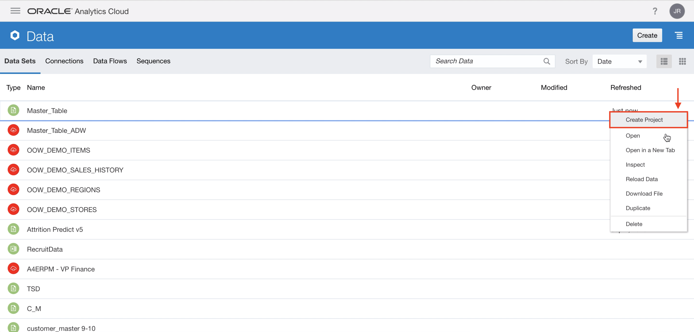
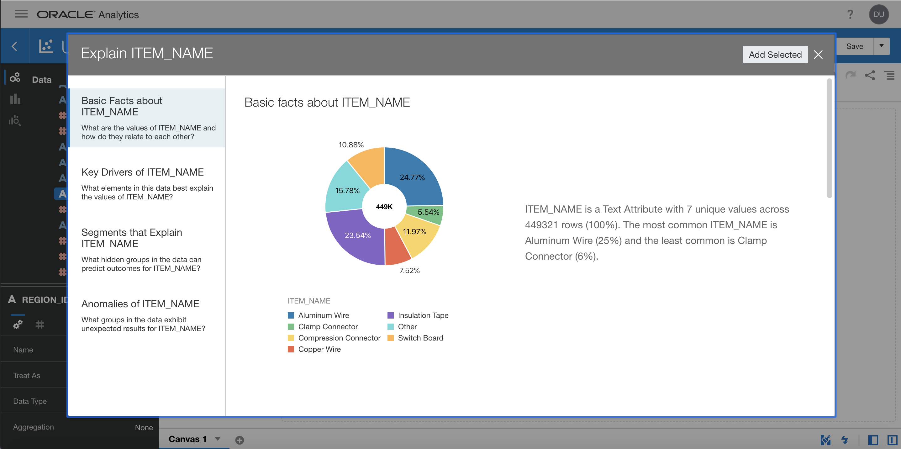
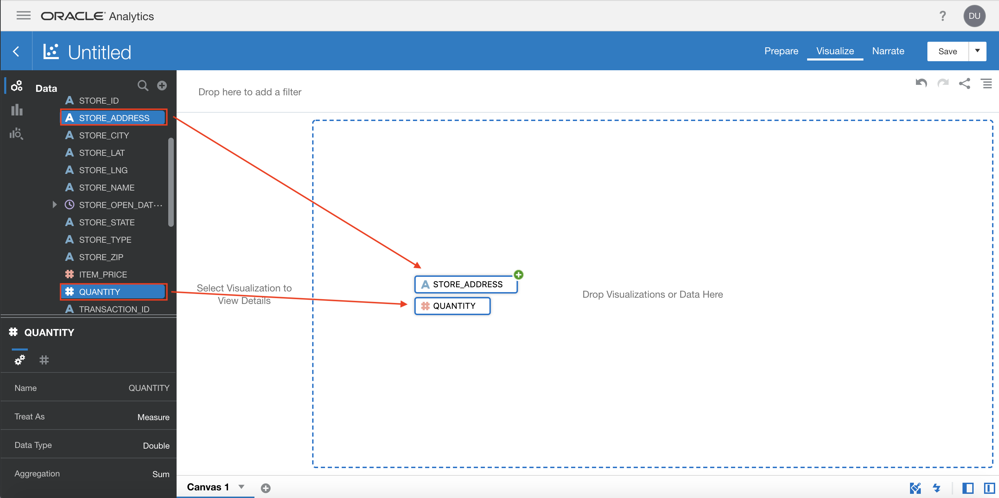
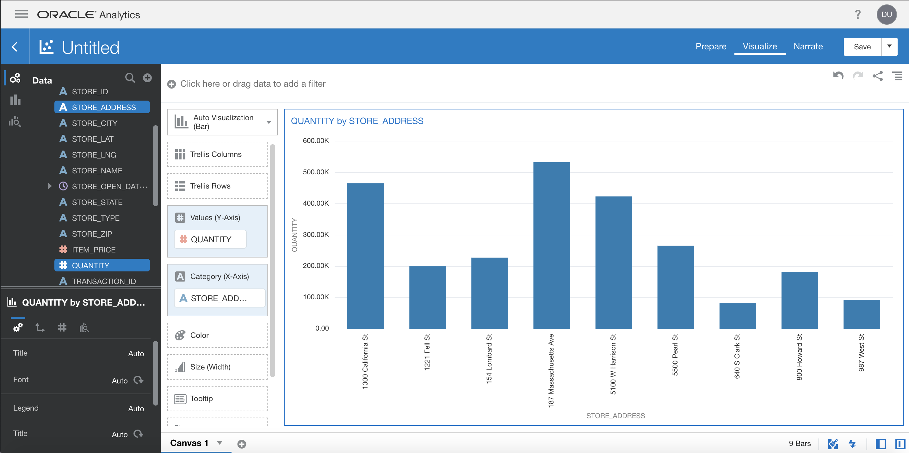
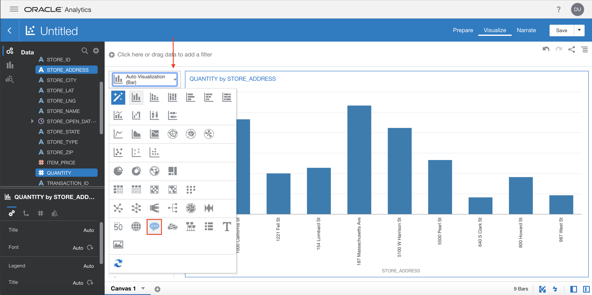
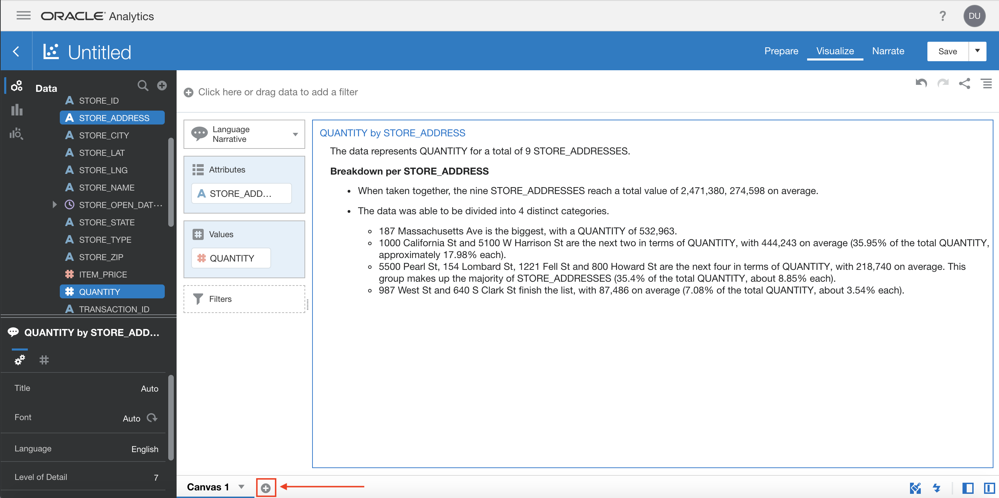
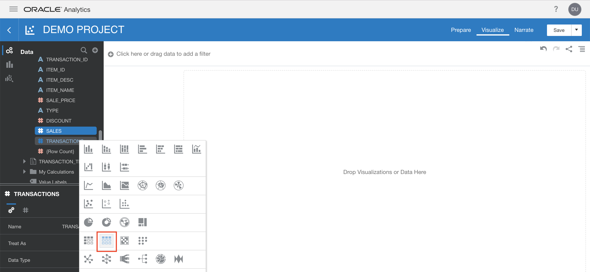
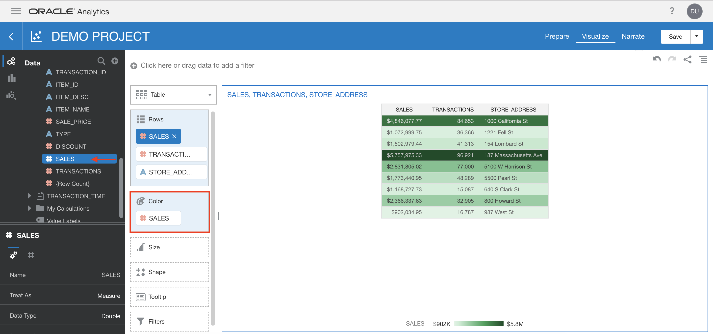

# Lab 500: Visualizations in Oracle Analytics Cloud (OAC)

<!-- Comment out table of contents
## Table of Contents
[Introduction](#introduction)
-->

## Introduction

This lab walks you through the steps on how you can use the Oracle Analytics Cloud to visualize entities from a database such as the results of the model created in OML.

**_To log issues_**, click here to go to the [github oracle](https://github.com/oracle/learning-library/issues/new) repository issue submission form.

### Objectives
-   Learn how to visualize entities from a database in Oracle Analytics Cloud such as an Oracle Machine Learning generated model.

### Required Artifacts
-   The following lab requires an Oracle Public Cloud account. You may use your own cloud account, a cloud account that you obtained through a trial, or a training account whose details were given to you by an Oracle instructor.
-   The estimated time to complete this lab is 10 minutes.

### Extra Resources
-   To learn more about Oracle Analytics Cloud (OAC), feel free to explore the capabilities by clicking on this link: [OAC Overview](https://www.oracle.com/business-analytics/analytics-cloud.html)

## Part 1. Visualize results in OAC

### **STEP 1**: Create a Project

-   From Oracle Analytics Cloud, click on the hamburger menu icon and click on **Data**. 

-   Then, find **Master_Table** and click on it's hamburger menu on the far right. From there, click on **Create Project**. This will make a new project based on the dataset.

### **STEP 2**: Create a Visualization

-   If you don't see all the columns, expand **Master_Table** on the left with the **small arrow** in order to see all the columns in the data set.

-   Scroll down until you see the **ITEM\_NAME** column.  **Right click** on this column and select **Explain ITEM\_NAME**.

-   A window will pop up Explaining the attribute **ITEM_NAME**.  Explain analyzes the selected column within the context of its data set and generates text descriptions about the insights it finds.  Explain uses Oracle's machine learning to generate accurate, fast, and powerful information about your data.  Explain automatically applies machine learning's statistical analysis to find the most significant patterns, correlations (drivers), classifications, and anomalies in your data.

-   Click through the four tabs in the Explain window: Basic Facts, Key Drivers, Segments that Explain, and Anomalies.  Note: These sections can often take 4-5 minutes to load data, as they are searching through a considerably large data set to produce these visualizations.

-   When you are finished navigating through all of the tabs in the Explain feature to get some initial insights on the ITEM_NAME column, **close out** of the Explain window to return to your canvas.

-   Next, you can begin making visualizations with your data.  From the list of data columns on the left, select **STORE_ADDRESS** and **QUANTITY**.  You can select them both at once by holding down either ctrl (Windows/Linux) or command (MacOS) depending on your operating system.  Once these two are both selected, you can simply drag these columns into the canvas on the right, automatically forming a visualization in the form of a bar graph.

-   Next, navigate to the dropdown on the top left of your canvas where it says 'Auto Visualization'.  Click into this drop down, and select the **Language Narrative** chart type, denoted by a text bubble.

-   This Natural Language Generation will take your visualization and actually convert that into text format so that you can get a better understanding of the underlying patterns represented in your visualization.  After reading, you can navigate to the **plus sign** on the bottom of the canvas shown in the screenshot below.  **Click** this plus sign to add a new canvas before you move onto the next step.

-   Select these three columns **STORE_ADDRESS**, **TRANSACTIONS**, **SALES** together from the dropdown by holding down either ctrl (Windows/Linux) or command (MacOS) depending on your operating system. Once all three are selected together, right click and select **Pick Visualization...**.

-   Then, click on the **Table Icon** to make a **Table** visualization. The visualization will appear on the right. The visualization may look slightly different and have different colors from the ones that appear here in the workshop.

-   Let's clean up how it looks. In the bottom left window, expand **SALES** by clicking on the **small arrow** and then click on **Number Format** and click on **Currency**.

-   Scroll down in the same window and expand **TRANSACTIONS** by clicking on the **small arrow** and then click on **Number Format** and click on **Number**.

-   Scroll down again and change **Decimal** for **TRANSACTIONS** to be **None**.

-   Finally, drag the column **SALES** from the left to the **Color** box.

-   Congratulations! You have made a visualization in just minutes that can help provide insight into the sales and transactions of various different stores. Make sure to hit **Save** in the top right to save your project.

-   The following are some other examples of what kinds of visualizations can be done in Oracle Analytics Cloud.  In the second screen capture, you can see how the machine learning data you created in this lab can be used to make prediction visualizations to give insight into future sales.

## Summary

-   In this lab, you visualized entities from a database (your ADW) in Oracle Analytics Cloud (OAC). These include visualizations such as an Oracle Machine Learning (OML) generated model.

-   **Congratulations, you have completed the main sections of this workshop!**

-   To recap, throughout this workshop, you experienced a wide breadth of the Oracle Cloud Data Plaform and its extensive capabilities! You provisioned and leveraged Oracle Cloud services such as Autonomous Data Warehouse (ADW), Application Express (APEX), Oracle Machine Learning (OML), SQL Developer Web, Oracle Analytics Cloud (OAC), Oracle Rest Data Services (ORDS), and, in the bonus labs, Oracle Digital Assistant (ODA). In this process, you journeyed to the Cloud to build a full fledged solution. You have a database for your needs, an app that interfaces with actionable analytic insights and machine learning models, and a chatbot that you can easily interact with using natural speech. Congratulations!

-   **Feel free to explore the bonus labs!** You will build an Oracle Digital Assitant (ODA) chatbot.

[Back to top](#introduction)
