# Lab 500: Visualizations in Oracle Analytics Cloud (OAC)

<!-- Comment out table of contents
## Table of Contents
[Introduction](#introduction)
-->

## Introduction

This lab walks you through the steps on how you can use the Oracle Analytics Cloud to visualize entities from a database such as the results of the model created in OML.

**_To log issues_**, click here to go to the [github oracle](https://github.com/oracle/learning-library/issues/new) repository issue submission form.

### Objectives
-   Learn how to visualize entities from a database in Oracle Analytics Cloud such as an Oracle Machine Learning generated model.

### Required Artifacts
-   The following lab requires an Oracle Public Cloud account. You may use your own cloud account, a cloud account that you obtained through a trial, or a training account whose details were given to you by an Oracle instructor.
-   The estimated time to complete this lab is 10 minutes.

### Extra Resources
-   To learn more about Oracle Analytics Cloud (OAC), feel free to explore the capabilities by clicking on this link: [OAC Overview](https://www.oracle.com/business-analytics/analytics-cloud.html)

## Part 1. Visualize results in OAC

### **STEP 1**: Create a Project

-   From Oracle Analytics Cloud, click on the hamburger menu icon and click on **Data**. 

-   Then, find **Master_Table** and click on it's hamburger menu on the far right. From there, click on **Create Project**. This will make a new project based on the dataset.

### **STEP 2**: Create a Visualization

-   If you don't see all the columns, expand **Master_Table** on the left with the **small arrow** in order to see all the columns in the data set.

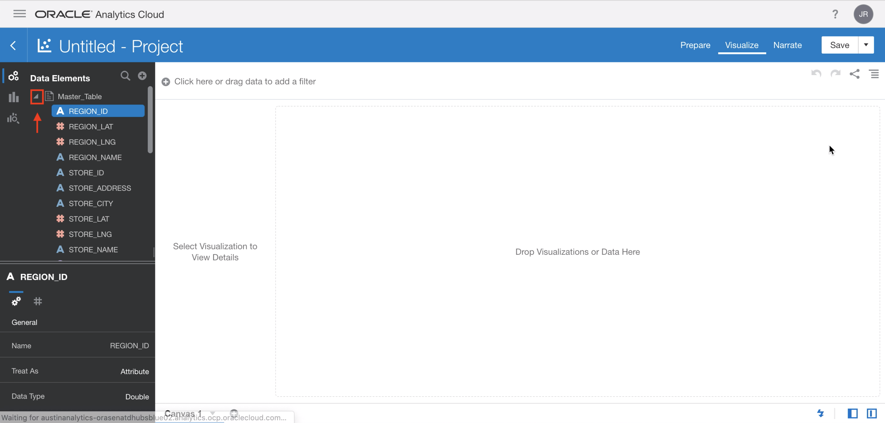

-   Scroll down until you see the **ITEM\_NAME** column.  **Right click** on this column and select **Explain ITEM\_NAME**.

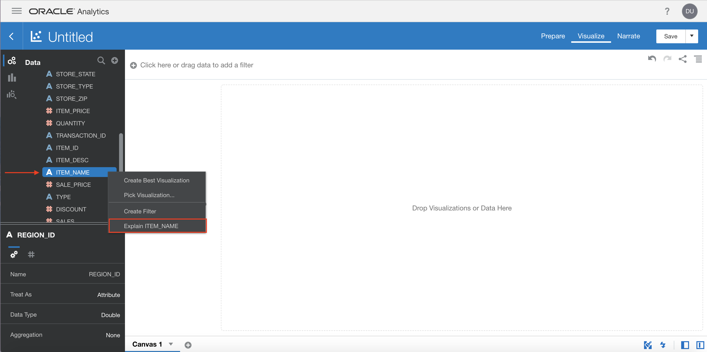

-   A window will pop up Explaining the attribute **ITEM_NAME**.  Explain analyzes the selected column within the context of its data set and generates text descriptions about the insights it finds.  Explain uses Oracle's machine learning to generate accurate, fast, and powerful information about your data.  Explain automatically applies machine learning's statistical analysis to find the most significant patterns, correlations (drivers), classifications, and anomalies in your data.  Note: These sections can often take 4-5 minutes to load data, as they are searching through a considerably large data set to produce these visualizations.

-   When the Explain window opens, you will first see Basic Facts about ITEM_NAME.  This page displays the basic distribution of the column's values. Column data is broken down against each of the data set's measures to give you some initial insights into what different values the column contains.  After getting some initial insights, **hover over** the top right corner of the donut chart to reveal a check mark, as shown in the image below.  **Click** on this **check mark**.  By doing this, you are selecting this visualization to later be added to your canvas.

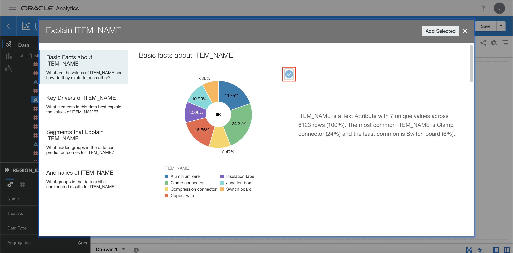

-   Now, **click** the next tab: **Key Drivers of ITEM_NAME**.  This page shows the columns in the data set that have the highest degree of correlation with the selected column outcome. Charts display the distribution of the selected value across each correlated attributes value.  Look through the different charts available.  Again, **hover over** the top right corner of one of the charts, and **click** the check mark, as shown in the image below.

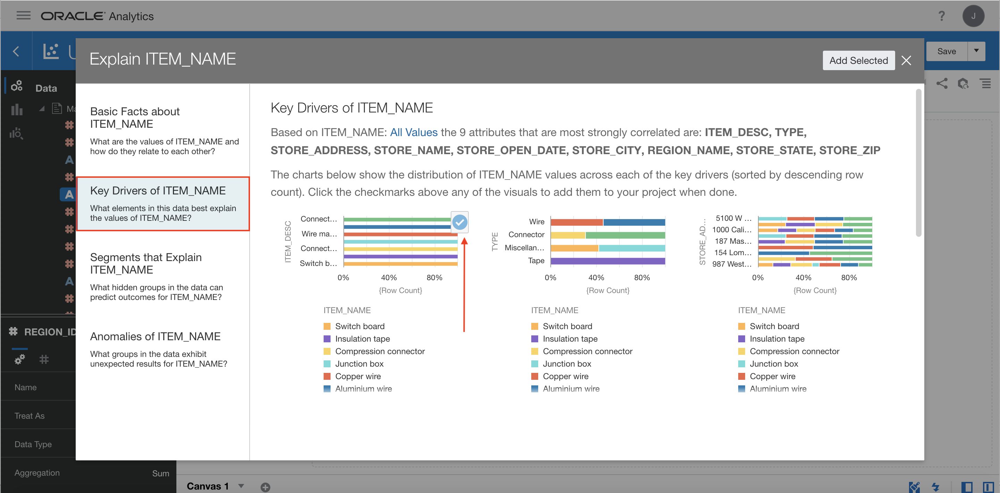

-   Next, **click** on the subsequent tab: **Segments that Explain ITEM_NAME**.  On this page, an algorithm is run on the data to determine data value intersections and identify ranges of values across all dimensions that generate the highest probability for a given outcome of the attribute.  Note: Depending on your screen size, you may need to scroll down a bit under the chart to see more information on what the chart is outlining.

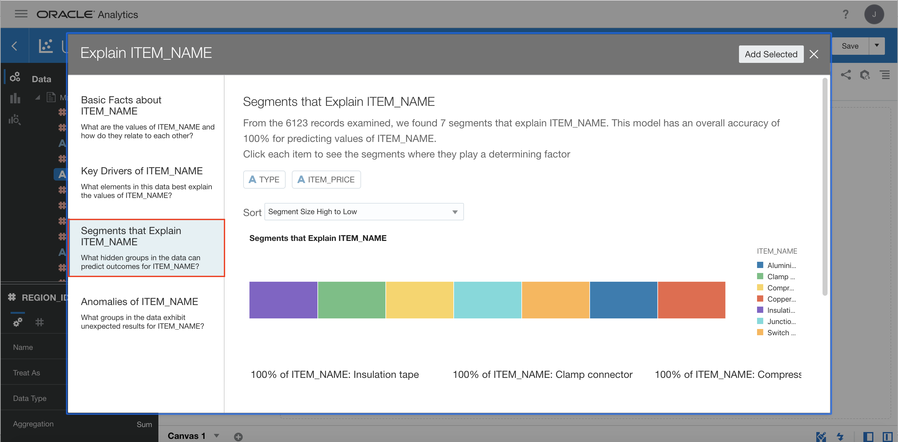

-   Finally, **click** on the last tab: **Anomalies of ITEM_NAME**.  You can scroll through this page to see charts that identify anomalies in your data set.  This page identifies a series of values where one of the values deviates substantially from what the regression algorithms expect.  After looking through the charts on this page, again **hover over** the top right corner of one of the charts and **click** on the check mark to select this graph to add it to your canvas.

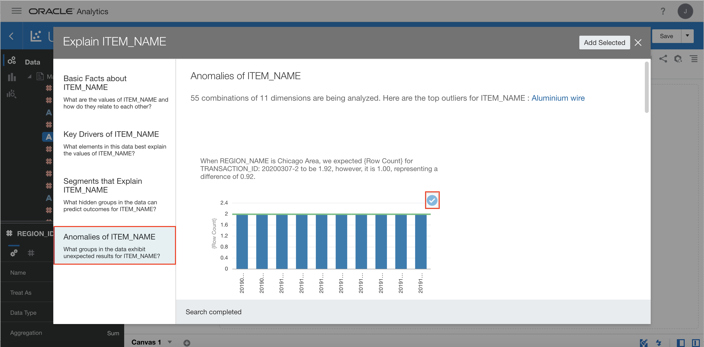

-   Now that you have used the Explain feature to look through various initial insights on ITEM_NAME, navigate to the upper right corner of the Explain window and click on **Add Selected**.

-   All of the visualizations that you selected should now appear on your first canvas!

-   Now, let's add another canvas by clicking on the **plus sign** on the bottom of your screen as shown in the image below.

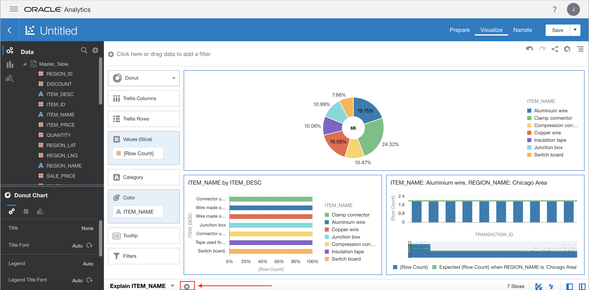

-   On this new canvas, we will add a new visual. From the list of data columns on the left, select **STORE_ADDRESS** and **QUANTITY**.  You can select them both at once by holding down either ctrl (Windows/Linux) or command (MacOS) depending on your operating system.  Once these two are both selected, **right click** and select **Create Best Visualization**.

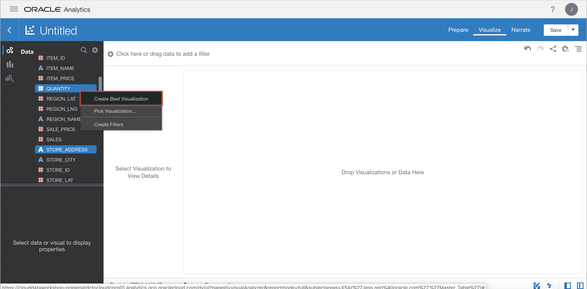

-   By selecting this option, OAC will intelligently create the best graph for your data; in this case, a bar graph.  On your chart, navigate to the menu upper right corner and **click**, as shown in the image below.

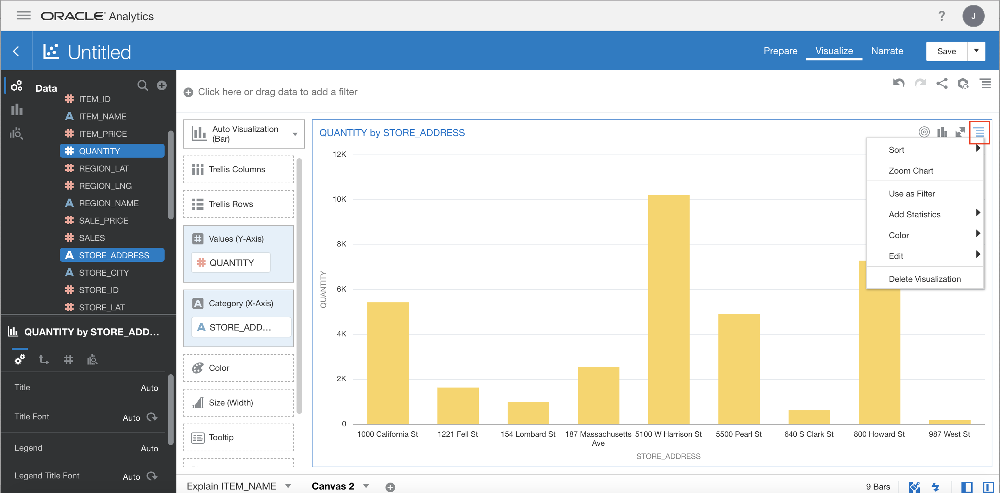

-   In this menu, navigate to **Edit**, then click on **Duplicate Visualization**.

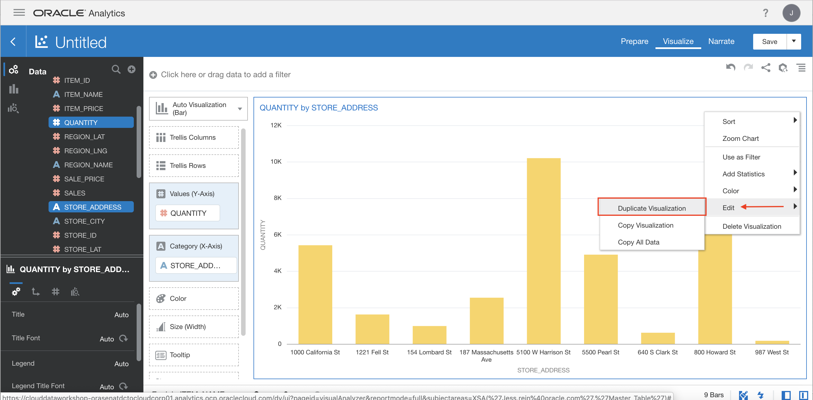

-   Now, you should have two copies of your bar chart on your canvas.  Next, we are going to utilize the Natural Language Generation capabilities of OAC, so it will be helpful to have these charts side-by-side.

-   Navigate to the dropdown on the top left of your canvas where it says 'Auto Visualization'.  Click into this drop down, and select the **Language Narrative** chart type, denoted by a text bubble.

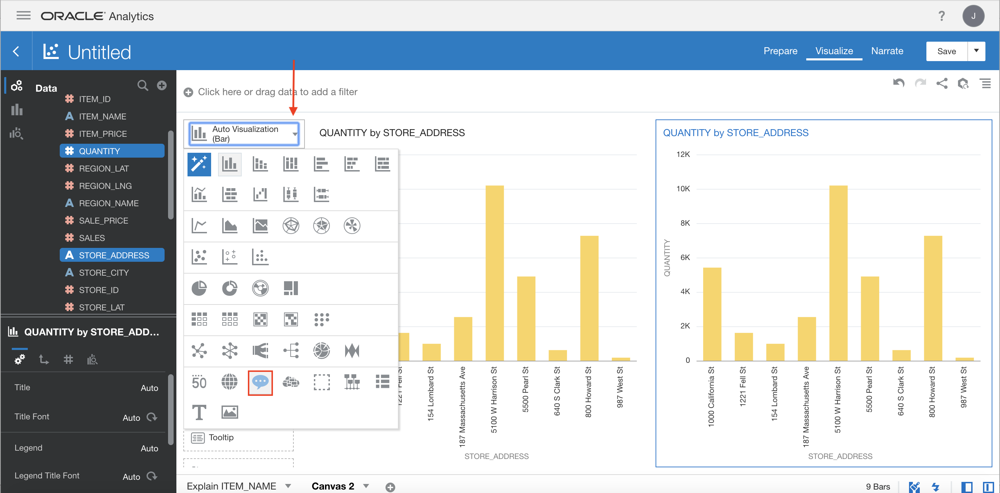

-   This Natural Language Generation will take your visualization and actually convert that into text format so that you can get a better understanding of the underlying patterns represented in your visualization.  With this explanation right next to your chart, you can use the Natural Language Generation to notice the trends and patterns of your visualization.  

-   After reading, you can navigate to the **plus sign** on the bottom of the canvas shown in the screenshot below.  **Click** this plus sign to add a new canvas before you move onto the next step.

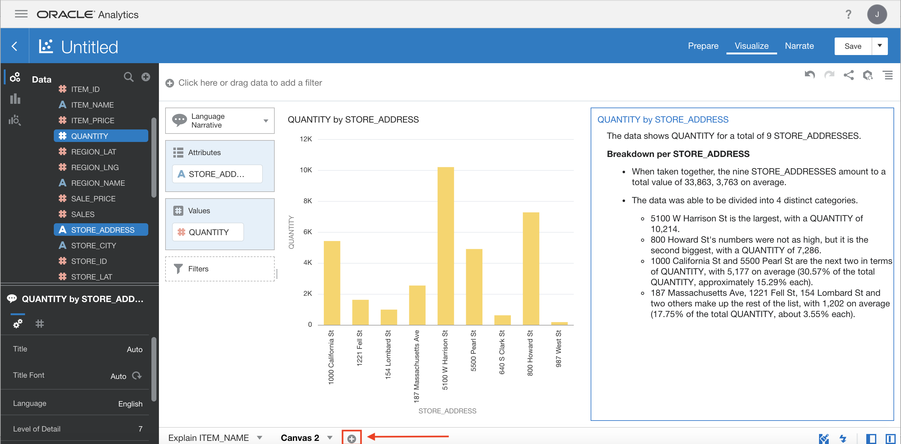

-   On this new Canvas, select these three columns **STORE_ADDRESS**, **TRANSACTIONS**, **SALES** together from the dropdown by holding down either ctrl (Windows/Linux) or command (MacOS) depending on your operating system. Once all three are selected together, right click and select **Pick Visualization...**.

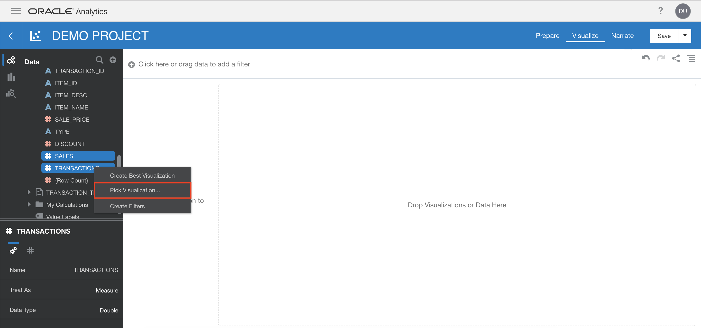

-   Then, click on the **Table Icon** to make a **Table** visualization. The visualization will appear on the right. The visualization may look slightly different and have different colors from the ones that appear here in the workshop.

-   Let's clean up how it looks. In the bottom left window, expand **SALES** by clicking on the **small arrow** and then click on **Number Format** and click on **Currency**.

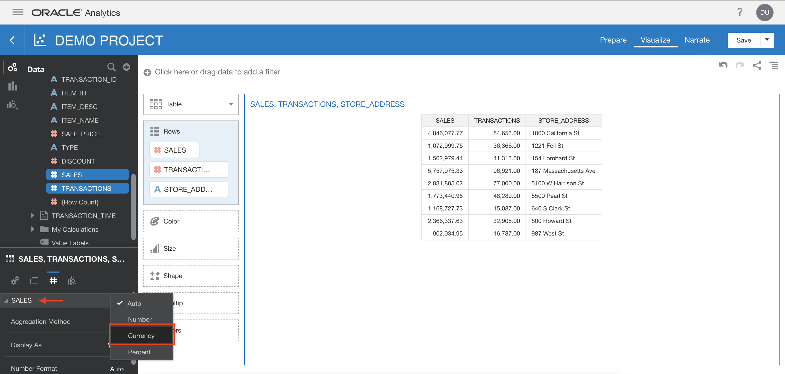

-   Scroll down in the same window and expand **TRANSACTIONS** by clicking on the **small arrow** and then click on **Number Format** and click on **Number**.

-   Scroll down again and change **Decimal** for **TRANSACTIONS** to be **None**.

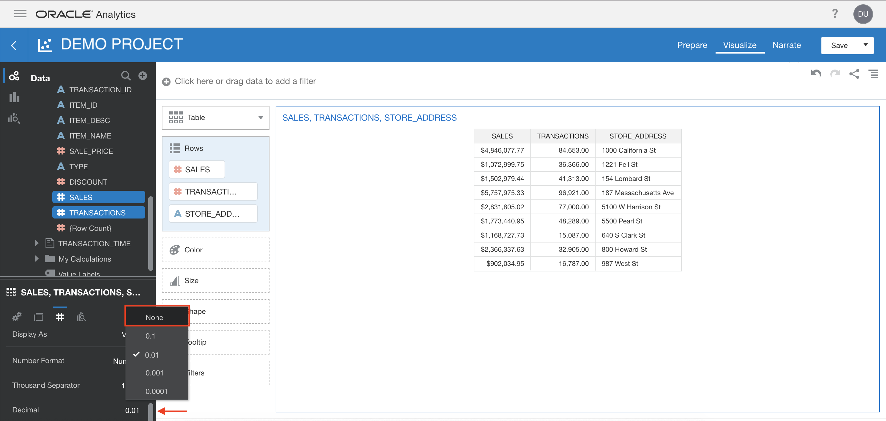

-   Finally, drag the column **SALES** from the left to the **Color** box.

-   Congratulations! You have made a visualization in just minutes that can help provide insight into the sales and transactions of various different stores. Make sure to hit **Save** in the top right to save your project.

-   The following are some other examples of what kinds of visualizations can be done in Oracle Analytics Cloud.  In the second screen capture, you can see how the machine learning data you created in this lab can be used to make prediction visualizations to give insight into future sales.

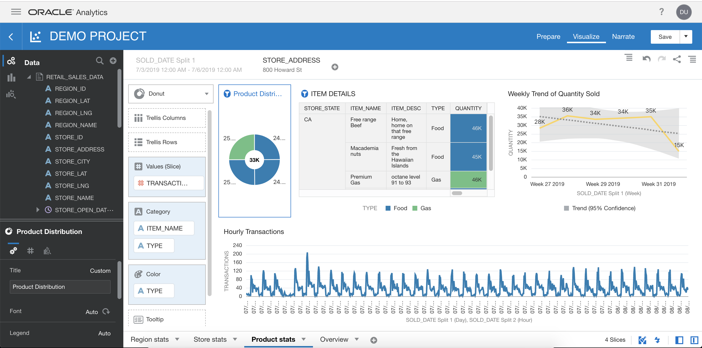

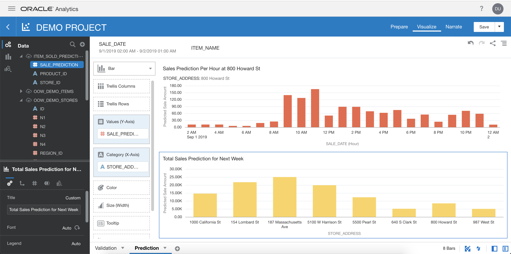

## Summary

-   In this lab, you visualized entities from a database (your ADW) in Oracle Analytics Cloud (OAC). These include visualizations such as an Oracle Machine Learning (OML) generated model.

-   **Congratulations, you have completed the main sections of this workshop!**

-   To recap, throughout this workshop, you experienced a wide breadth of the Oracle Cloud Data Plaform and its extensive capabilities! You provisioned and leveraged Oracle Cloud services such as Autonomous Data Warehouse (ADW), Application Express (APEX), Oracle Machine Learning (OML), SQL Developer Web, Oracle Analytics Cloud (OAC), Oracle Rest Data Services (ORDS), and, in the bonus labs, Oracle Digital Assistant (ODA). In this process, you journeyed to the Cloud to build a full fledged solution. You have a database for your needs, an app that interfaces with actionable analytic insights and machine learning models, and a chatbot that you can easily interact with using natural speech. Congratulations!

-   **Feel free to explore the bonus labs!** You will build an Oracle Digital Assitant (ODA) chatbot.

[Back to top](#introduction)
