# Lab 600: Implementing APEX APIs into Oracle Digital Assistant (ODA)

<!-- Comment out table of contents
## Table of Contents
[Introduction](#introduction)
-->

## Introduction

In this lab, you will learn how to provision an Oracle Digital Assistant instance and design a Skill in which you will implement your APIs from the APEX portion of this workshop.  These APIs will be utilized in order to make REST calls to the Autonomous Data Warehouse to get information on store predictions.  These REST API calls will be tested through interacting with the chatbot dialogue.

**_To log issues_**, click here to go to the [github oracle](https://github.com/oracle/learning-library/issues/new) repository issue submission form.

### Objectives

-   Learn how to provision Oracle Digital Assistant (ODA)
-   Learn how to import/design an Oracle Digital Assistant Skill
-   Learn how to implement REST APIs through Digital Assistant
-   Learn how to test Digital Assistant Dialogue

### Required Artifacts

-   The following lab requires an Oracle Public Cloud account. You may use your own cloud account, a cloud account that you obtained through a trial, or a training account whose details were given to you by an Oracle instructor.
-   The estimated time to complete this lab is 20 minutes.

## Part 1. Provisioning a Digital Assistant Instance

-   Inside of the OCI Console, click on the top left menu icon.

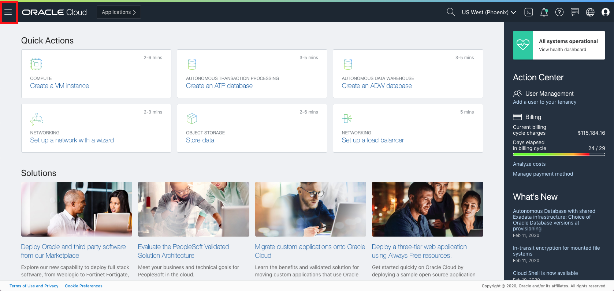

-   In the side menu, navigate to **Digital Assistant** under Data and AI.

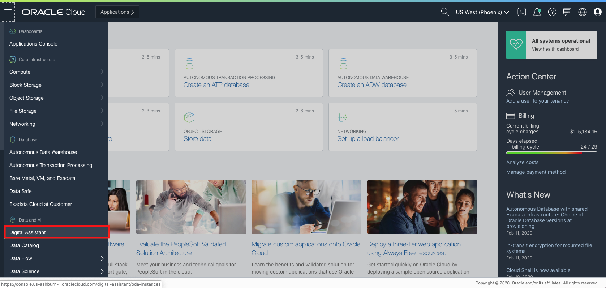

-   On the Digital Assistant Instances screen, click on **Create a Digital Assistant Instance**.

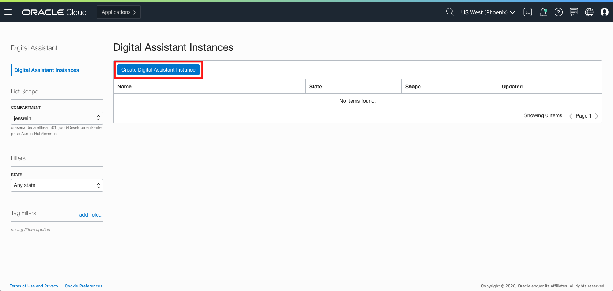

-   To create your Digital Assistant instance, first select the root compartment, or whichever compartment you provisioned your ADW instance in during Lab 100.  Use **"DemoDigitalAssistant"** for the name, and choose shape **Production**.  When you are finished, click **Create**.

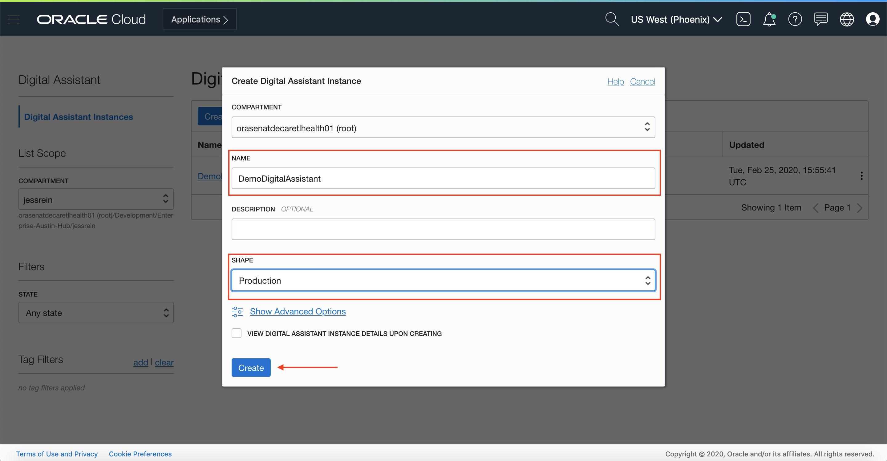

-   After clicking create, you will see your Digital Assistant instance listed, with the state 'Creating'.  This shouldn't take more than a couple of minutes to provision.

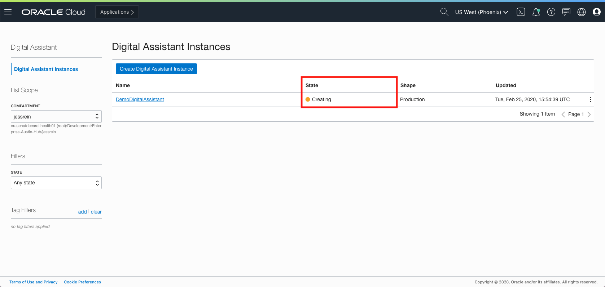

-   Once the instance is fully provisioned, you will see the state changed to 'Active'.  Once this instance is active, click on the three dots on the right of the instance listing, and select **Service Console**.

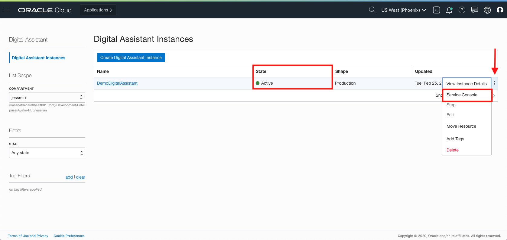

-   Note: feel free to learn more about Oracle Digital Assistant (ODA) by clicking on the following text link: [ODA Overview](https://www.oracle.com/application-development/cloud-services/digital-assistant/)

## Part 2. Creating a Skill in Digital Assistant

### **Step 1:** Re-sign in to your Oracle Cloud Account.

-   After selecting Service Console, you will be prompted to enter your Cloud Tenant Name.  Here, enter your **Cloud Account Name** associated with your account.  Note: This is not your username, this is the name of your cloud tenancy.

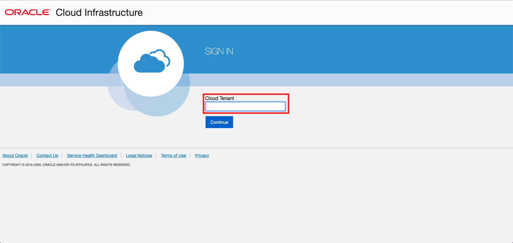

-   Next, you will be taken to a login screen.  Here, enter your username and password, and click **Sign In**.

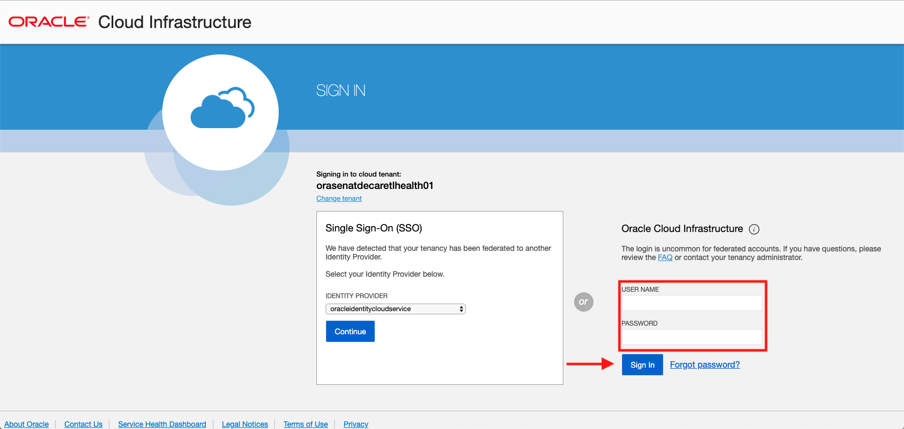

### **Step 2:** Import a Digital Assistant Skill

-   Once you are signed in, you will be taken to the Oracle Digital Assistant home page.  To begin, click the top left hamburger menu.

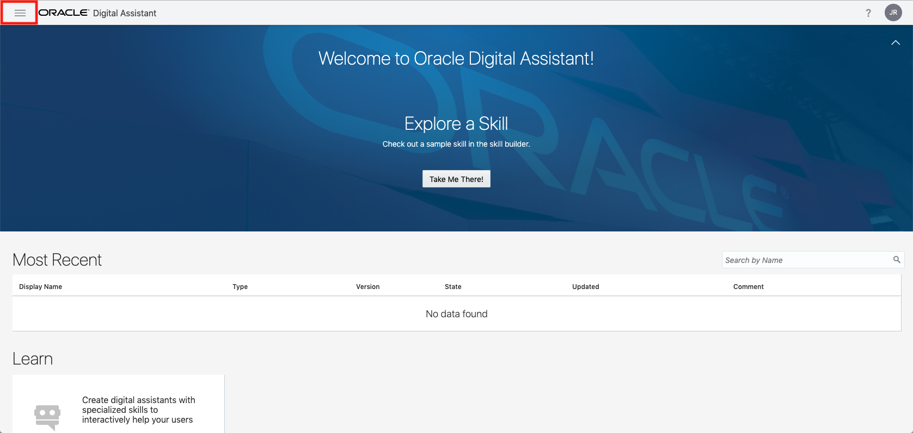

-   In this side menu, select **Development**, then click **Skills**.

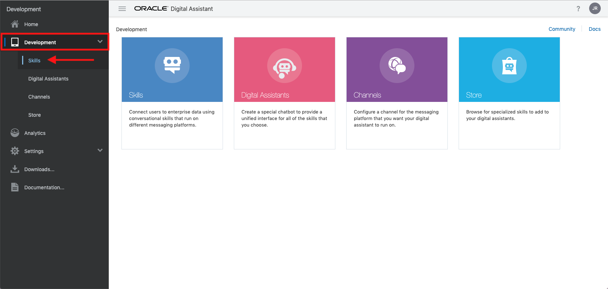

-   You will download a dataset file from this workshop to load into ODA. You can download it by right clicking on the following text link and selecting **Save link as**. Keep the default options when downloading: [Download DemoDigitalAssistantSkill.zip here](./files/DemoDigitalAssistantSkill.zip). Then, open your browser window again back to the Oracle Digital Assistant page.

-   Once you are back on the Skills tab, click **Import Skill**.  Select the **DemoDigitalAssistantSkill.zip** you just downloaded for the workshop.

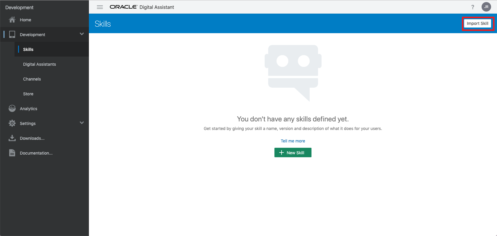

-   Once imported, you will need to refresh your browser, then you should see the 'Demo Digital Assistant Skill' on your Skills screen.  Click on **Demo Digital Assistant Skill**.

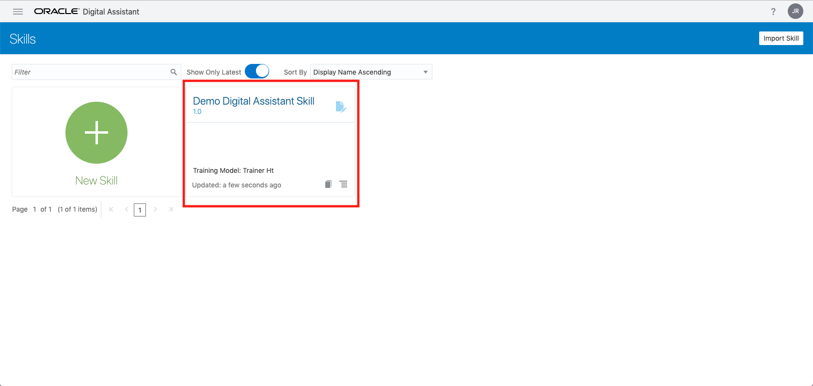

## Part 3. Implement REST APIs into Digital Assistant to access data from ADW

### **Step 1:** Add REST API URLs to Digital Assistant Code

-   After clicking your skill, navigate to the **Flows** tab on the left menu.

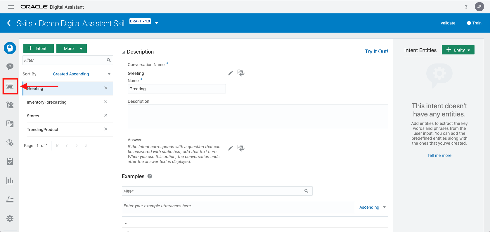

-   Next, navigate to the 'states' section of the code where you can see **Set Trending Product API Value** and **Set Inventory Forecast API Value**.

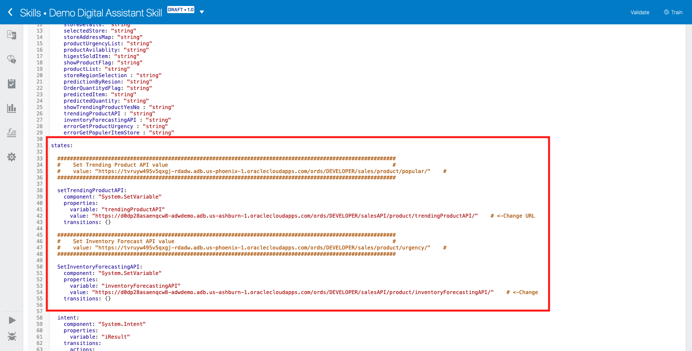

-   Let's start with the Trending Product API value.  Under the **setTrendingProductAPI** definition on line 38, you will see the **value** is set to "null" on line 42.  Replace "null" with your **Trending Product API URL** that you took note of from the APEX portion of this workshop.  IMPORTANT: Make sure to remove everything after the 'trendingProductAPI/', making sure to leave the / at the end.  Be sure to keep this URL inside the quotation marks to properly assign the value.

-   Next, navigate to the **SetInventoryForecastingAPI** definition on line 50, shown in the image above.  On line 54, change the **value** from "null" to your **Inventory Forecast API URL** you took note of in the APEX portion of this workshop.  IMPORTANT: Make sure to remove everything after the 'inventoryForecastingAPI/', making sure to leave the / at the end.  Be sure to keep the URL inside of the quotation marks.

-   After you have properly entered your API URLs, go ahead and click the **Validate** button in the top right corner.  

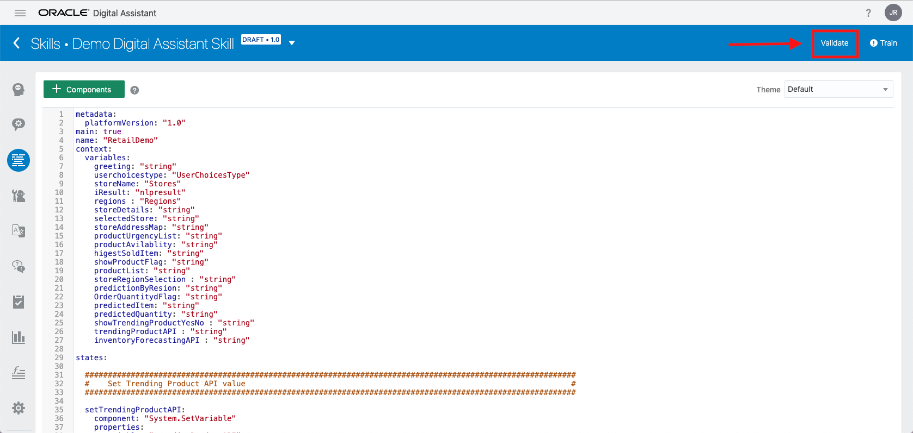

-   After a few seconds, click **Train**.  Keep the **Trainer Ht** intent selected along with **Entity**.  Next, click **Submit**.  Once your model is fully trained, you will see a checkmark next to the **Train** button.

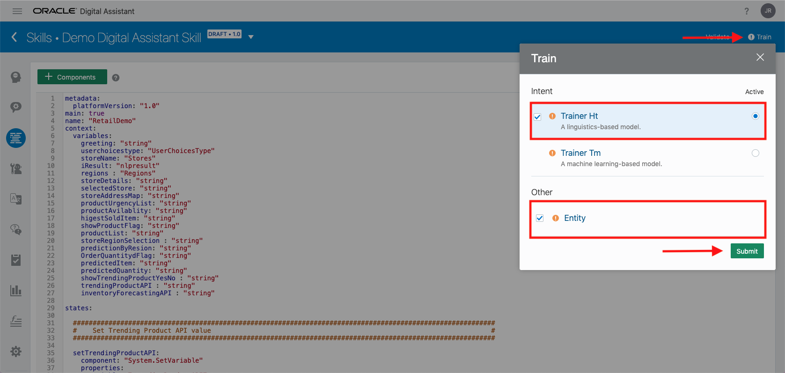

### **Step 3:** Test API Calls in Digital Assistant Conversation Flow

-   To test the APIs you just implemented, click on the Skill Tester('Play') button on the bottom left of the side menu.

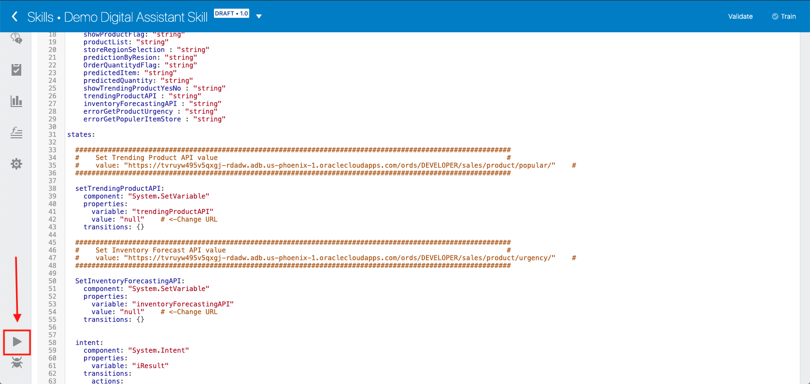

-   A chat screen will appear where you can begin testing your API calls through a conversation flow. Begin by typing "Hi".  The bot should respond to you with the response shown in the image below.  From here, follow the dialogue exactly as shown in the images below. When the bot responds with a list of different buttons, be sure to **click** on them to select your choices.  You will not need to do any typing to the bot aside from your initial "Hi": all you will need to do is respond by clicking the buttons that the chatbot sends you.

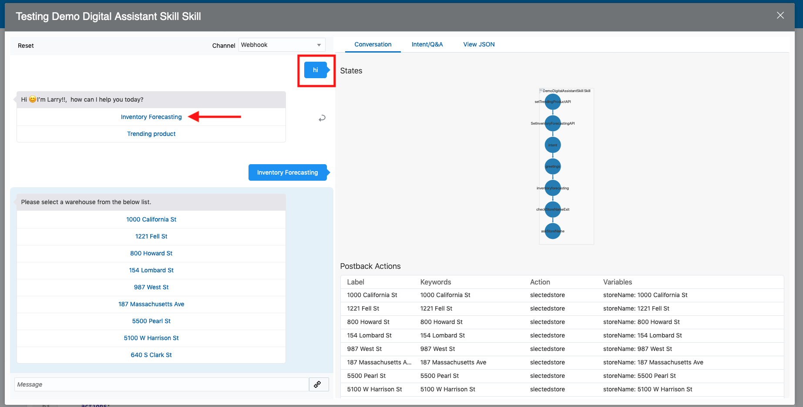

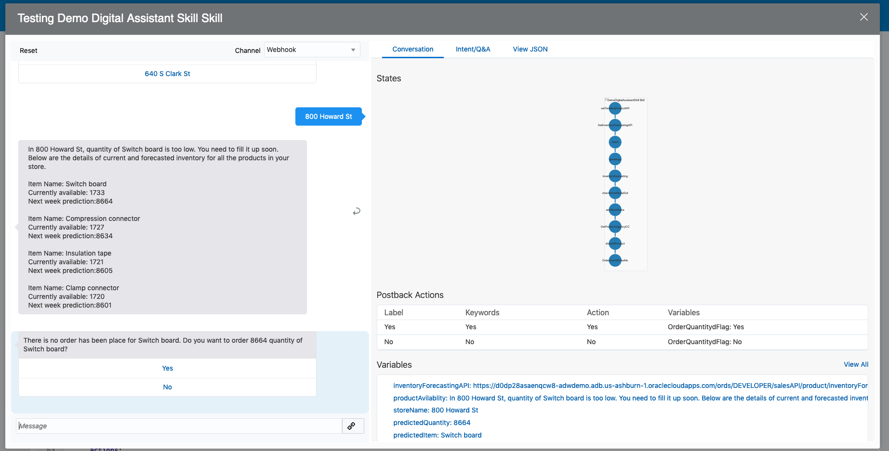

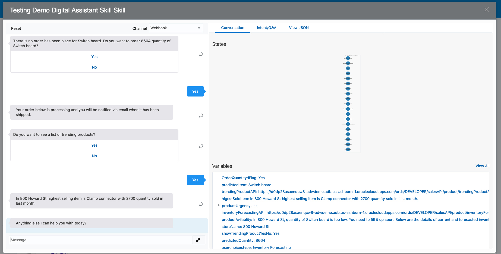

-   You might notice that in the conversation with the chatbot, when you ask for 'Inventory Forecasting' and 'Trending Products', the bot takes a few extra seconds to respond to you.  This is because at this time, the bot is doing a REST API call to your ADW to retrieve the necessary data.

## Summary

-   In this lab, you provisioned Oracle Digital Assistant (ODA), imported/designed an Oracle Digital Assistant Skill, implemented REST APIs through Digital Assistant, and tested Digital Assistant Dialogue.

- **You have completed all of the labs! Congratulations for completing the Oracle’s Cloud Data Platform: Autonomous-Driven & AI-Infused Workshop!**

[Back to top](#introduction)
